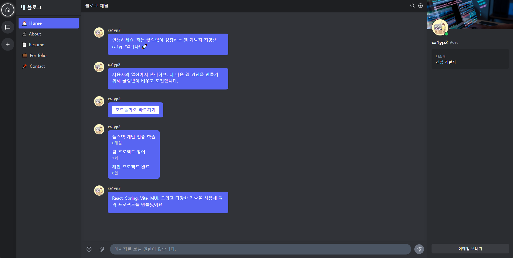
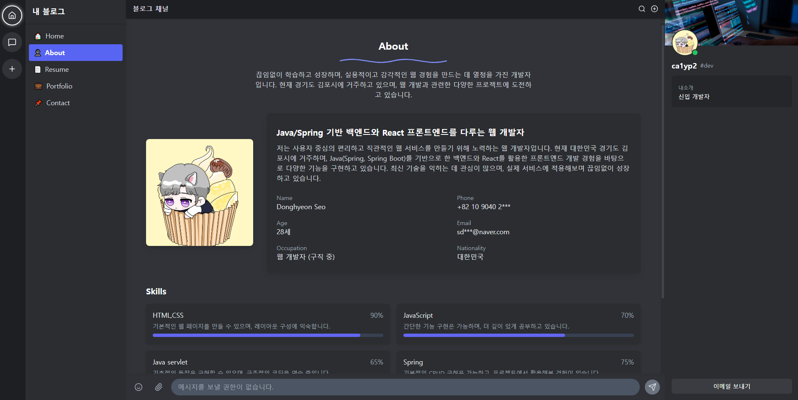
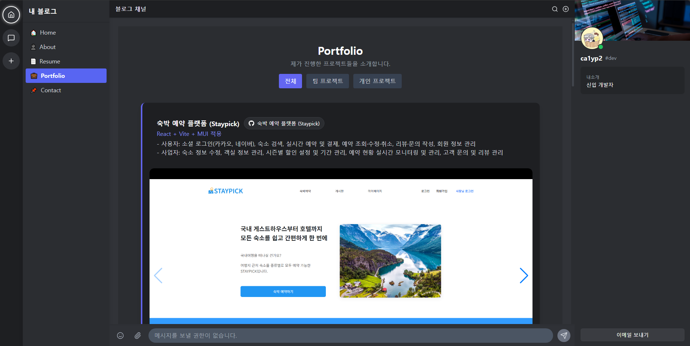
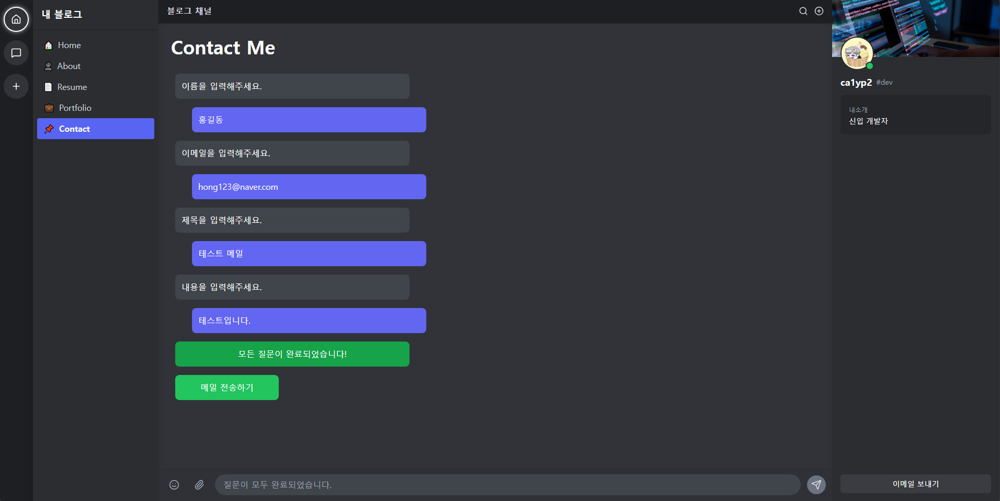

# 📝 React Blog Portfolio

  
[🔗 데모 사이트](https://ca1yp2.github.io/)

---

## 📌 프로젝트 소개
**React Blog Portfolio**는 React와 Vite 기반의 개인 포트폴리오 웹사이트입니다.  
Discord 애플리케이션 UI 테마를 적용하여 **채팅형 인터페이스와 사이드바, 카드 UI** 등 깔끔한 현대적 디자인을 제공합니다.
팀/개인 프로젝트, 자기소개, 이력서, 연락처 등 다양한 정보를 확인할 수 있으며, **이메일 전송 기능**까지 포함되어 있습니다.

---

## 🛠 기술 스택
- **Frontend:** React 18, Vite, React Router v6
- **Styling:** Tailwind CSS
- **Animations:** Framer Motion
- **Icons & Components:** Lucide React, React Icons
- **Slider:** Swiper
- **Email Service:** EmailJS
- **배포:** GitHub Pages

---

## 📃 페이지 구성

### 1. Home
- 메인 인사 메시지, 통계/버튼 메시지 표시
- Discord 스타일 채팅형 UI
- `/data/home.json`에서 데이터 로드
- Framer Motion 애니메이션 적용



### 2. About
- 자기소개, 프로필 이미지, 개인 정보, 스킬 표시
- 스킬 프로그레스 바로 수준 표시
- Discord 테마 카드 디자인
- 스크롤 진입 시 Framer Motion 애니메이션 적용
- `/data/about.json`에서 데이터 로드



### 3. Resume
- 경력 및 학력 정보 타임라인 표시
- 카드 등장 애니메이션 적용
- `/data/resume.json`에서 데이터 로드


### 4. Portfolio
- 프로젝트 갤러리 표시
- 필터링: 전체 / 팀 프로젝트 / 개인 프로젝트
- 이미지 슬라이더: Swiper + 썸네일 연동
- GitHub 링크 버튼 제공
- `/data/portfolio.json`에서 데이터 로드



### 5. Contact
- 채팅형 입력으로 이름, 이메일, 제목, 내용 수집
- 질문 완료 시 EmailJS를 통해 이메일 전송
- 입력 후 자동 스크롤
- `/contact` 페이지에서만 입력 활성화



---

## 📒 공통 컴포넌트
- **ServerSidebar:** 왼쪽 서버/메뉴 아이콘 패널
- **ChannelSidebar:** 페이지 이동 메뉴
- **MemberPanel:** 사용자 정보 + 이메일 버튼
- **Topbar:** 상단 메뉴/검색 아이콘
- **BottomBar:** Contact 페이지 입력창

---

## 📁 프로젝트 구조

```
my_react_blog/
├─ public/
│ └─ data/ # JSON 데이터 파일
├─ src/
│ ├─ components/ # 공통 UI 컴포넌트
│ ├─ pages/ # 페이지 컴포넌트
│ ├─ App.jsx # 최상위 컴포넌트
│ └─ index.jsx # React Router 설정
├─ package.json
└─ vite.config.js
```

---

## ▶️ 설치 및 실행 방법

```bash
# 프로젝트 클론
git clone https://github.com/ca1yp2/ca1yp2.github.io.git
cd ca1yp2.github.io

# 패키지 설치
npm install

# 개발 서버 실행
npm run dev
```

---

## 📤 GitHub Pages 배포 방법 (수동)

1. 프로젝트 빌드
```bash
npm run build
```

2. dist/ 폴더 안의 파일을 GitHub 저장소의 gh-pages 브랜치에 커밋
```bash
# 예시: gh-pages 브랜치로 이동
git checkout gh-pages

# 빌드 파일 복사 후 커밋
cp -r dist/* .
git add .
git commit -m "Deploy React Blog"
git push origin gh-pages
```
3. GitHub Pages 설정에서 gh-pages 브랜치를 소스로 지정
4. https://ca1yp2.github.io/ 접속

--

## 🌟 주요 기능

- SPA 구조와 React Router 기반 페이지 전환
- Tailwind CSS + Framer Motion으로 현대적 UI/UX 제공
- 프로젝트 필터링 및 Swiper 기반 이미지 갤러리
- 채팅형 Contact 페이지 + 이메일 전송 기능
- JSON 데이터 기반 콘텐츠 관리
- Discord UI 테마 적용: 사이드바, 채팅창, 카드, 버튼 등 전체 UI 통일

---

## 🖥 배포 링크

[🌐 React Blog Portfolio Live](https://ca1yp2.github.io/)

---

## 📄 라이선스

MIT 라이선스 (MIT License)

저작권 (c) 2025 ca1yp2

본 프로젝트는 학습 및 개인 포트폴리오 용도로 제작되었습니다. 본 소프트웨어 및 관련 문서 파일(이하 "소프트웨어")을 무상으로 획득한 모든 사람에게 소프트웨어를 제한 없이 사용, 복사, 수정, 병합, 출판, 배포, 서브라이선스 및 판매할 권리를 허가합니다.

단, 위 저작권 표시와 이 허가 표시를 소프트웨어의 모든 복사본 또는 중요한 부분에 포함시켜야 합니다.

본 소프트웨어는 상품성, 특정 목적 적합성 및 비침해에 대한 보증 없이 "있는 그대로" 제공됩니다. 저작권자 또는 저작권 보유자는 소프트웨어 사용 또는 기타 거래와 관련하여 발생하는 어떠한 청구, 손해 또는 기타 책임에 대해서도 책임을 지지 않습니다.

---

MIT License

Copyright (c) 2025 ca1yp2

This project was created for learning and personal portfolio purposes. Permission is hereby granted, free of charge, to any person obtaining a copy of this software and associated documentation files (the "Software"), to deal in the Software without restriction, including without limitation the rights to use, copy, modify, merge, publish, distribute, sublicense, and/or sell copies of the Software, and to permit persons to whom the Software is furnished to do so, subject to the following conditions:

The above copyright notice and this permission notice shall be included in all copies or substantial portions of the Software.
